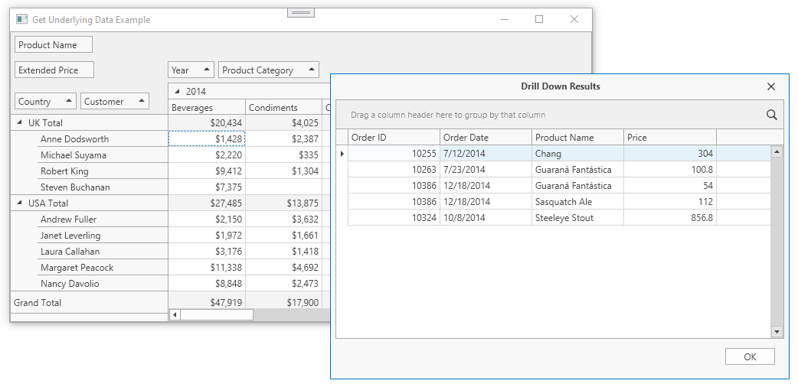

<!-- default badges list -->

<!-- default badges end -->
# Pivot Grid for WPF - How to Display Underlying (Drill-Down) Records

This example demonstrates how to obtain the records from the control's underlying data source for a particular cell. Double-click a cell to invoke a form that contains a grid to show the underlying data.

This example is based on the [DevExpress MVVM Framework](https://docs.devexpress.com/WPF/15112).  When a user double-clicks a cell, the [EventToCommand](https://docs.devexpress.com/WPF/17369) class invokes the bound **ShowDrillDownDataCommand** defined in the ViewModel. 

To pass the event data as a parameter to the command, the [EventToCommand.PassEventArgsToCommand](https://docs.devexpress.com/WPF/DevExpress.Mvvm.UI.EventToCommand.PassEventArgsToCommand) property is set to **true**. The [EventArgsToCellInfoConverter](https://docs.devexpress.com/WPF/DevExpress.Xpf.PivotGrid.EventArgsToCellInfoConverter) instance is assigned to the [EventToCommand.EventArgsConverter](https://docs.devexpress.com/WPF/DevExpress.Mvvm.UI.EventToCommand.EventArgsConverter) property to convert the event data to the [CellInfo](https://docs.devexpress.com/WPF/DevExpress.Xpf.PivotGrid.CellInfo) parameter type required for the command.

The command calls the **DialogService.ShowDialog** method to invoke a custom window that displays the underlying data. The [DialogService](https://docs.devexpress.com/WPF/17467) is a part of the DevExpress MVVM Framework. It is defined in XAML and specifies the [DXDialogWindow](https://docs.devexpress.com/WPF/DevExpress.Xpf.Core.DXDialogWindow) that contains the [GridControl](https://docs.devexpress.com/WPF/DevExpress.Xpf.Grid.GridControl) bound to the [CellInfo.DrillDownDataSource](https://docs.devexpress.com/WPF/DevExpress.Xpf.PivotGrid.CellInfo.DrillDownDataSource) property.

> You can also use the following methods to get the underlying data:

* [CellInfo.CreateDrillDownDataSource](https://docs.devexpress.com/WPF/DevExpress.Xpf.PivotGrid.CellInfo.CreateDrillDownDataSource) that returns the collection of records in the original data source with the [IEnumerable](https://docs.microsoft.com/ru-ru/dotnet/api/system.collections.ienumerable) interface. 
* The [PivotGridControl.CreateDrillDownDataSource](https://docs.devexpress.com/WPF/DevExpress.Xpf.PivotGrid.PivotGridControl.CreateDrillDownDataSource.overloads) method and  **CreateDrillDownDataSource** methods available in PivotGridControl event handlers return the [PivotDrillDownDataSource](https://docs.devexpress.com/WPF/DevExpress.Xpf.PivotGrid.PivotDrillDownDataSource) object.

> Asynchronous drill-down operations are performed with the following methods:

* [CellInfo.CreateDrillDownDataSourceAsync](https://docs.devexpress.com/WPF/DevExpress.Xpf.PivotGrid.CellInfo.CreateDrillDownDataSourceAsync)
* [PivotGridControl.CreateDrillDownDataSourceAsync ](https://docs.devexpress.com/WPF/DevExpress.Xpf.PivotGrid.PivotGridControl.CreateDrillDownDataSourceAsync.overloads)

<!-- default file list -->
## Files to Look At

* [MainWindow.xaml](CS/ObtainUnderlyingData/MainWindow.xaml) (VB: [MainWindow.xaml](VB/ObtainUnderlyingData/MainWindow.xaml))
* [MainWindow.xaml.cs](CS/ObtainUnderlyingData/MainWindow.xaml.cs) (VB: [MainWindow.xaml.vb](VB/ObtainUnderlyingData/MainWindow.xaml.vb))
* [ViewModel.cs](CS/ObtainUnderlyingData/ViewModel.cs) (VB: [ViewModel.vb](VB/ObtainUnderlyingData/ViewModel.vb))
<!-- default file list end -->

## Documentation

* [Drill-Down to the Underlying Data](https://docs.devexpress.com/WindowsForms/1882)
* [Asynchronous Mode](https://docs.devexpress.com/WPF/9776)

## More Examples

* [How to Use CreateDrillDownDataSource Methods to Display Underlying (Drill-Down) Data](https://github.com/DevExpress-Examples/wpf-pivotgrid-how-to-display-underlying-data)
<!-- feedback -->
## Does this example address your development requirements/objectives?

 

(you will be redirected to DevExpress.com to submit your response)
<!-- feedback end -->
